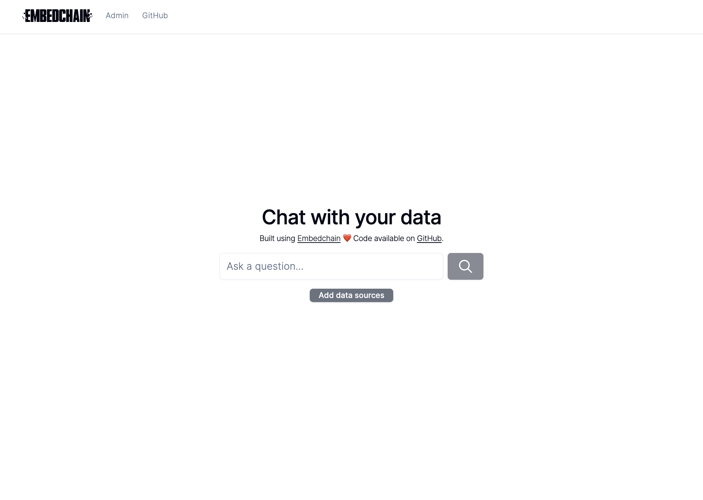
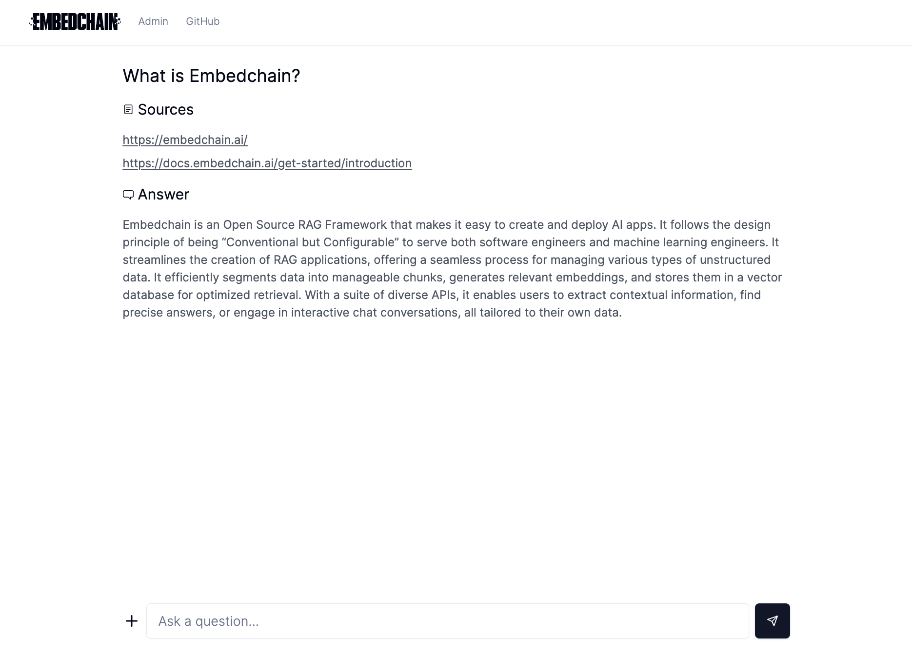
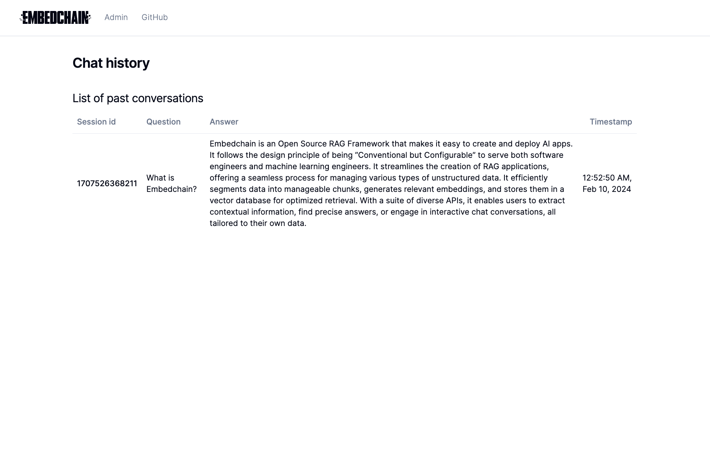
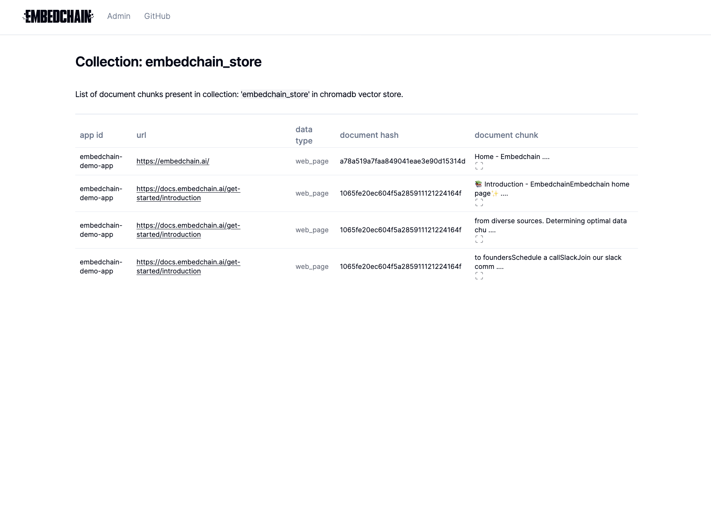
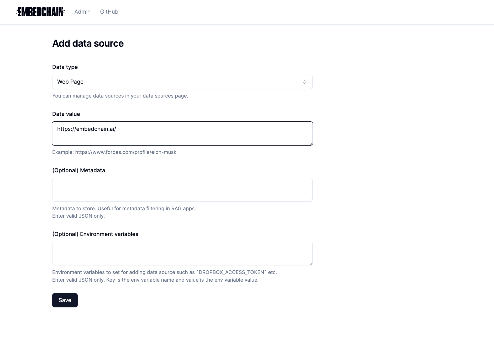

# Embedchain Admin

Welcome to the Embedchain Admin repository. This toolkit helps you build a full-stack RAG (Retrieve, Append, Generate) application with a focus on simplicity and functionality, powered by Embedchain.

## 🚀 Features

- **Chat Interface:** A clean and simple interface for messaging.
- **Streaming:** Supports live data streaming.
- **Citations:** Allows integration of citations within the chat.
- **Model Support:** Compatible with both proprietary and open-source models.
- **Admin Panel:**
    - View chat history.
    - Manage embeddings.
    - Configure data sources through the UI.

## Tech Stack

This project uses:

- FastAPI: For the backend, making it fast and easy to develop.
- NextJS: For the frontend, enabling responsive and dynamic web pages.
- Embedchain: Powers the core functionalities like chat and streaming.


## Getting Started

To start using Embedchain Admin for your project, install python package using:

```bash
pip install embedchain
```

Now, if you use docker, you can simply run the following commands:

### With docker
```bash
ec create-app my-app --docker
cd my-app
ec start --docker
```

### Without docker

```bash
ec create-app my-app
cd my-app
ec start
```

You are all set now. Open http://localhost:3000 to view the chat UI.

## Screenshots

### Chat



### Search



### Chat history



### Collections



### Data sources


